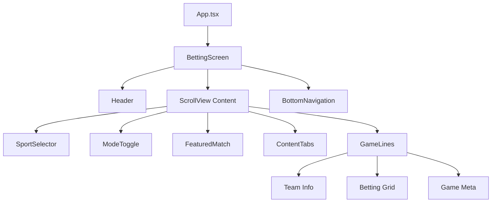

# 🏈 STIMI Sports Betting App

<div align="center">


**A modern, pixel-perfect sports betting mobile application built with React Native & Expo**

[](https://reactnative.dev/)
[](https://expo.dev/)
[](https://www.typescriptlang.org/)

[Demo](#-demo) • [Features](#-features) • [Installation](#-installation) • [Usage](#-usage) • [Architecture](#-architecture)

</div>

---

## 📱 Demo

<div align="center">

### NFL Betting Interface
*Beautiful dark theme with gradient accents and intuitive betting controls*

**Key Screens:**
- 🏠 **Home Dashboard** - Featured matches and quick access
- 🏈 **NFL Betting** - Live odds and betting options  
- 💰 **Betting Modes** - Cash & Coin toggle functionality
- 📊 **Game Lines** - Spread, Money, Total betting options

</div>

---

## ✨ Features

### 🎨 **Modern UI/UX**
- **Dark Theme Design** - Sleek, modern interface with carefully crafted colors
- **Gradient Backgrounds** - Eye-catching purple-to-blue gradients
- **Pixel-Perfect Layout** - Meticulously designed to match Figma specifications
- **Smooth Animations** - Fluid transitions and interactive elements

### 🏈 **Sports Betting Core**
- **NFL Game Lines** - Real-time betting odds for NFL games
- **Multiple Bet Types** - Spread, Moneyline, and Total betting options
- **Live Odds Display** - Dynamic odds with proper formatting (+1.5, -155, etc.)
- **Team Information** - Team logos, names, and game schedules

### 💡 **Interactive Features**
- **Betting Mode Toggle** - Switch between Cash and Coin modes
- **Dynamic Color System** - Odds text changes color based on selected mode
  - 🟢 **Cash Mode** - Green text (`#4CAF50`)
  - 🟡 **Coin Mode** - Yellow text (`#FFD700`)
- **Responsive Buttons** - Outlined betting buttons with hover effects
- **Content Tabs** - Popular and Same Game Parlay sections

### 📱 **Navigation & Layout**
- **Fixed Header** - STIMI branding with search and authentication
- **Bottom Navigation** - 5-tab navigation (Home, Sports, My Bets, Live Now, Account)
- **Smooth Scrolling** - Full-page scroll with fixed header/footer
- **Space-Between Layouts** - Perfect alignment and spacing

---

## 🚀 Installation

### Prerequisites
- **Node.js** (v16 or higher)
- **npm** or **yarn**
- **Expo CLI** (optional, for enhanced development experience)

### Quick Start

```bash
# Clone the repository
git clone <your-repo-url>
cd stimi-assessment

# Install dependencies
npm install

# Start the development server
npm start
```

### Platform-Specific Commands

```bash
# iOS Simulator (requires Xcode)
npm run ios

# Android Emulator (requires Android Studio)
npm run android

# Web Browser
npm run web
```

---

## 📖 Usage

### Development

1. **Start the Expo development server:**
   ```bash
   npm start
   ```

2. **Choose your platform:**
   - **📱 Mobile**: Scan QR code with Expo Go app
   - **🖥️ Simulator**: Press `i` for iOS or `a` for Android
   - **🌐 Web**: Press `w` for web browser

3. **Live Reload**: Changes automatically update in real-time

### Features Walkthrough

1. **Header Navigation**
   - Search functionality
   - Login/Join authentication buttons

2. **Sport Selection**
   - NFL sport selector with game count
   - Dropdown for other sports (future)

3. **Betting Mode Toggle**
   - Toggle between Cash and Coin modes
   - Visual feedback with color changes

4. **Featured Match**
   - Highlighted game with gradient background
   - People placed indicator
   - Game date/time

5. **Game Lines**
   - Team matchups with logos
   - 2×3 betting grid layout
   - Spread, Money, Total columns
   - "More Wagers" links

---

## 🏗️ Architecture

### Project Structure

```
stimi-assessment/
├── 📱 App.tsx                 # Main app entry point
├── 📄 app.json               # Expo configuration
├── 📦 package.json           # Dependencies and scripts
├── 🎨 assets/                # Images and icons
│   ├── icon.png
│   ├── splash-icon.png
│   └── ...
└── 📁 src/
    ├── 🧩 components/         # Reusable UI components
    │   ├── Header.tsx         # App header with branding
    │   ├── SportSelector.tsx  # Sport selection dropdown
    │   ├── FeaturedMatch.tsx  # Featured game card
    │   ├── ContentTabs.tsx    # Popular/Parlay tabs
    │   ├── GameLines.tsx      # Betting odds grid
    │   ├── ModeToggle.tsx     # Cash/Coin toggle
    │   └── BottomNavigation.tsx
    ├── 🎨 constants/          # App constants
    │   ├── colors.ts          # Color palette
    │   └── mockData.ts        # Sample NFL data
    ├── 📱 screens/            # Main app screens
    │   └── BettingScreen.tsx  # Primary betting interface
    ├── 🔧 types/              # TypeScript definitions
    │   └── index.ts           # Type definitions
    └── 🛠️ utils/              # Utility functions
```

### Component Architecture



### Key Technologies

- **⚛️ React Native 0.79.5** - Cross-platform mobile framework
- **📱 Expo ~53.0.20** - Development platform and tools
- **📘 TypeScript ~5.8.3** - Type-safe JavaScript
- **🎨 expo-linear-gradient** - Beautiful gradient backgrounds
- **🎯 Custom Hooks** - State management and logic separation

---

## 🎨 Design System

### Color Palette

```typescript
// Primary Colors
background: '#000000'     // Pure black background
textPrimary: '#FFFFFF'    // Primary white text
textSecondary: '#CCCCCC'  // Secondary gray text

// Accent Colors
accentBlue: '#4A90E2'     // Button borders and accents
accentPink: '#FF6B9D'     // Active states and highlights

// Mode Colors
cashMode: '#4CAF50'       // Green for cash betting
coinMode: '#FFD700'       // Yellow for coin betting

// Gradients
gradientStart: '#8B5CF6'  // Purple gradient start
gradientEnd: '#3B82F6'    // Blue gradient end
```

### Typography

- **Headers**: Bold, 20-24px, White
- **Body Text**: Medium, 16px, White/Gray
- **Odds**: Bold, 12px, Dynamic (Green/Yellow)
- **Meta**: Regular, 14px, Gray

### Layout Principles

- **Consistent Spacing**: 8px, 12px, 16px grid system
- **Flexible Components**: Responsive design patterns
- **Visual Hierarchy**: Clear information architecture
- **Touch-Friendly**: 44px minimum touch targets

---

## 🔮 Future Enhancements

### Planned Features
- 🔐 **User Authentication** - Login/register functionality
- 💾 **Bet Slip Management** - Add/remove bets, calculate payouts
- 📊 **Live Odds Updates** - Real-time data integration
- 🏀 **Multi-Sport Support** - Basketball, Baseball, Soccer
- 📈 **Betting History** - Track wins, losses, and statistics
- 🔔 **Push Notifications** - Game alerts and promotions
- 🌐 **API Integration** - Live sports data feeds

### Technical Improvements
- ⚡ **Performance Optimization** - Memoization and virtualization
- 🧪 **Testing Suite** - Unit and integration tests
- 📱 **Native Modules** - Enhanced mobile capabilities
- 🔄 **State Management** - Redux or Zustand integration

---

## 🤝 Contributing

We welcome contributions! Here's how to get started:

1. **Fork** the repository
2. **Create** a feature branch (`git checkout -b feature/amazing-feature`)
3. **Commit** your changes (`git commit -m 'Add amazing feature'`)
4. **Push** to the branch (`git push origin feature/amazing-feature`)
5. **Open** a Pull Request

### Development Guidelines
- Follow TypeScript best practices
- Maintain consistent code formatting
- Add comments for complex logic
- Test on multiple platforms
- Update documentation as needed

---

## 📄 License

This project is private and proprietary. All rights reserved.

---

## 📞 Support

For questions, issues, or feature requests:

- 📧 **Email**: [support@stimi.com](mailto:support@stimi.com)
- 💬 **Issues**: Create a GitHub issue
- 📖 **Documentation**: Check the wiki

---

<div align="center">

**Built with ❤️ for sports betting enthusiasts**

*STIMI - Where Sports Meet Innovation*

</div>
